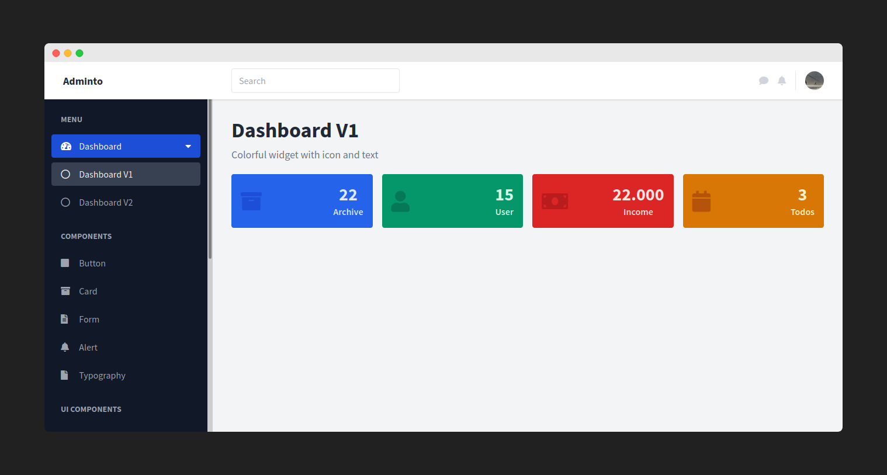

## Adminto

[](https://opensource.org/licenses/MIT)



Adminto adalah template admin sederhana siap pakai untuk semuanya, dibuat dengan tailwindcss.

Tampilanya sederhana, dilengkapi dengan komponen yang cukup lengkap.

Bisa digunakan di projek website sehingga mempercepat proses pengerjaan.

## Pengembangan

Adminto masih sangat belia, masih butuh pengembangan lebih lanjut seperti penambahan komponen, integrasi plugin, dll.

Untuk pengembangan silahkan membantu pengembangan projek ini jika anda berminat.

## Alat dan Bahan

* Gulp
* Tailwindcss

## Struktur Folder

* `dist` folder ini berisi file javascript, css, gambar, dan html sudah dikompilasi sehingga bisa kalian gunakan langsung
* `src` folder ini berisi file javascript, css, gambar, dan html yang digunakan untuk pengembangan

## Instalasi

Untuk menggunakanya kalian hanya perlu meng-*clone* repo ini.

Didalam folder hasil clone terdapat folder `dist`, didalam folder tersebut terdapat file-file hasil kompilasi yang bisa digunakan dalam projek anda.

### Clone Repo

```bash
# Clone repo-nya
$ git clone https://github.com/ibrahimalanshor/adminto.git

# Buka folder hasil clone
$ cd adminto
```

### Pengembangan

Untuk pengembangan pastikan sudah menginstal alat dan bahan.
```bash
# Instal alat dan bahan
$ npm install
```

### Perintah

```bash
# Pengembangan auto compile
$ npm start

# Pengembangan
$ npm run dev

# Produksi
$ npm run prod
```
